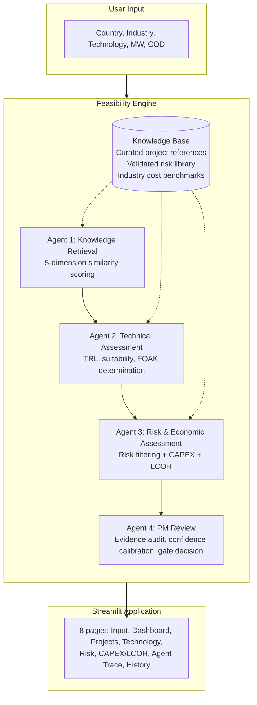

# Green Hydrogen Project Feasibility Copilot

**A structured pre-feasibility assessment engine for industrial green hydrogen projects — PEM and Alkaline electrolysis.**

[](https://github.com/YOUR_USERNAME/hydrogen-copilot)
[](https://python.org)
[](https://streamlit.io)
[](tests/)
[](LICENSE)

---

## How It Works in 20 Seconds

Enter five project parameters and receive a structured pre-feasibility assessment with CAPEX range, LCOH estimate, risk identification, and technology readiness evaluation.

```
Input                         Output
────────────────────────────────────────────────────────────
Country:    France            Gate Decision:      PROCEED WITH CAUTION
Industry:   Steel             Technology:         PEM — TRL 8/9
Technology: PEM               Suitability:        HIGH for H2-DRI
Capacity:   100 MW            CAPEX:              EUR 150M (EUR 1,500/kW)
COD:        2029              LCOH:               EUR 4.96/kg
                              Top Reference:      Normand'Hy (Score: 0.81)
                              Top Risk:           Manufacturing Capacity (RPN 36)
                              Critical Gap:       No steel-offtake PEM reference
```

Every number is traceable to its evidence source — industry reports, project data, or engineering standards.

---

## Screenshots

| Page | Preview | Description |
|------|---------|-------------|
| **Executive Dashboard** |  | Gate decision with dimension quality scores and KPI metrics |
| **Agent Trace** (flagship) |  | Complete reasoning chain from input to gate decision |
| **CAPEX & LCOH** |  | Cost breakdown, LCOH waterfall, sensitivity tornado diagram |

> Screenshot capture instructions: [docs/screenshots/screenshot_capture_guide.md](docs/screenshots/screenshot_capture_guide.md)

---

## Table of Contents

- [Why This Project Matters](#why-this-project-matters)
- [Architecture](#architecture)
- [Key Features](#key-features)
- [What Makes This Different](#what-makes-this-different)
- [Validation Results](#validation-results)
- [Knowledge Base](#knowledge-base)
- [Limitations](#limitations)
- [Quick Start](#quick-start)
- [Technology Stack](#technology-stack)
- [Roadmap](#roadmap)

---

## Why This Project Matters

Pre-feasibility assessments for hydrogen projects require weeks of manual research: locating comparable reference projects, extracting technology specifications from OEM documentation, compiling risk registers from incident databases, and normalising cost data across multiple IEA and IRENA reports.

This Copilot replaces that process with a structured, deterministic, fully traceable engine.

### Who Uses It

| Role | Use Case |
|------|----------|
| **Project Managers** | Conduct pre-feasibility studies with defensible reference benchmarks |
| **Engineering Consultants** | Evaluate technology options with documented methodology |
| **PMO Teams** | Perform project gate reviews with auditable evidence trails |
| **Business Developers** | Screen project opportunities with consistent criteria |

### What It Answers

- Which existing projects are most similar to my project?
- Is this technology mature enough for my application at my scale?
- What are the top risks I should plan for?
- What is a realistic CAPEX range for this project profile?
- What drives the cost of hydrogen production?
- What critical information is not yet known?

---

## Architecture



### Design Approach

- **Deterministic by design.** All calculations use documented formulas — the same query always produces the same result.
- **Zero external dependencies for the engine.** The core reasoning module uses only Python standard library.
- **File-based knowledge base.** Adding a new reference project requires one JSON file — no database, no schema migration.
- **Full source traceability.** Every conclusion links to its evidence source, methodology, and confidence assessment.

---

## Key Features

### Project Similarity Matching

Five-dimension weighted scoring against a curated European hydrogen project dataset:

| Dimension | Weight | Scoring Method |
|-----------|--------|----------------|
| Technology match | 30% | Exact or hybrid (PEM, Alkaline, PEM+Alkaline) |
| Industry / Offtake match | 25% | Exact, secondary, or related category |
| Capacity similarity | 25% | Logarithmic function, symmetric |
| Country proximity | 15% | Same country, neighbour, sub-region, continent |
| Project maturity | 5% | Operational > Under construction > Planned |

### Technology Readiness Assessment

Structured assessment drawn from Technology Knowledge Cards:

- TRL evaluation with deployment evidence from IEA and IRENA references
- Application suitability scoring per industrial offtake type (steel, refinery, ammonia, mobility)
- First-of-a-kind (FOAK) risk assessment — separately for scale and for application
- Scale feasibility check against proven deployment range

### Risk Identification

Filters a validated risk library by technology, project scale, and phase:

- FMEA-based scoring: Probability x Impact x Detectability (RPN 1-125)
- 8 risk categories: Technical, Supply Chain, Grid and Energy, Regulatory, Financial, Construction, Operational, Environmental
- Each risk linked to project evidence and documented mitigation actions

### CAPEX Estimation

AACE Class 4 methodology with taxonomy-based cost breakdown:

- 8 cost categories with category-specific scaling for different plant sizes
- Learning curve projections (PEM 15%, Alkaline 10% per capacity doubling)
- FOAK premium for novel applications or unproven scales
- Weighted confidence scoring per cost component
- P10-P90 range with methodology documentation

### LCOH Calculation

Levelized Cost of Hydrogen with full decomposition:

- Waterfall breakdown: CAPEX, electricity, stack replacement, maintenance, labour, other
- Tornado sensitivity analysis identifying dominant cost drivers
- Every input parameter documented with source and confidence

### Full Decision Traceability

The Agent Trace page visualises the complete reasoning chain — every conclusion linked to its evidence source, methodology reference, and confidence assessment. Designed for project governance and audit readiness.

### PM Gate Review

PMBOK-inspired phase-gate assessment:

- Four-dimension quality scoring
- Cross-dimension consistency checking
- Confidence calibration against evidence quality
- Structured conditions for advancement

---

## What Makes This Different

### Structured Engineering Decision-Support

This is not a machine learning model. It is an **explainable reasoning system** built on documented industrial methodologies. Every calculation — similarity scoring, risk quantification, cost scaling, LCOH decomposition — uses transparent formulas that can be inspected, challenged, and reproduced.

### Traceability as a Design Principle

The Agent Trace page is not an afterthought. Every number in the assessment report links to its evidence source. The CAPEX estimate cites a cost benchmark, which cites an IEA report, which has a published methodology and a source quality classification. A reviewer can independently verify any conclusion.

### Industrial Methodologies

| Standard | Application |
|----------|-------------|
| AACE International 18R-97 | Cost estimate classification |
| ISO 31000:2018 | Risk management framework |
| IEC 60812 (FMEA) | Failure Mode and Effects Analysis |
| PMBOK Phase-Gate | Project governance and stage review |

### Source-Governed Knowledge

Every data point in the knowledge base follows a published four-level quality taxonomy (A/B/C/D) with mandatory source attribution. No unverified or anonymous data is used.

---

## Validation Results

The engine has been validated against five pre-feasibility scenarios with 35 regression tests.

### Test Matrix

| Case | Query | Top Match | Score | CAPEX Range | LCOH | Gate Decision |
|------|-------|-----------|-------|-------------|------|--------------|
| 1 | France, Steel, PEM, 100 MW, 2029 | Normand'Hy | 0.81 | EUR 110-210M | EUR 4.96/kg | PROCEED WITH CAUTION |
| 2 | Germany, Industrial, Alkaline, 300 MW, 2030 | Holland Hydrogen I | 0.93 | EUR 250-550M | EUR 4.17/kg | PROCEED |
| 3 | Spain, Refinery, PEM, 20 MW, 2028 | Masshylia | 0.93 | EUR 25-55M | EUR 5.59/kg | PROCEED |
| 4 | Belgium, Chemicals, Alkaline, 25 MW, 2029 | Hyoffwind | 0.75 | EUR 25-70M | EUR 4.89/kg | PROCEED WITH CAUTION |
| 5 | Portugal, Industrial, PEM, 100 MW, 2030 | Galp Sines | 1.00 | EUR 100-220M | EUR 4.96/kg | PROCEED |

### What Was Verified

- **Matching accuracy:** top-ranked project is always the most relevant by domain-expert judgment
- **Technology consistency:** TRL and suitability match Technology Card specifications
- **Risk completeness:** all 8 risk categories populated
- **CAPEX plausibility:** estimates within AACE Class 4 accuracy expectations
- **LCOH plausibility:** electricity identified as the dominant driver (consistent with hydrogen economics literature)
- **Gate logic:** PROCEED for cases with adequate evidence; PROCEED WITH CAUTION for cases with knowledge gaps

---

## Knowledge Base

| Asset | Content | Source Quality |
|-------|---------|---------------|
| **Project references** | 10 European green hydrogen projects (Normand'Hy, HH1, REFHYNE II, HGHH, HyDeal, Puertollano, HySynergy, Hyoffwind, Galp Sines, Masshylia) | Official project disclosures and authoritative industry reports |
| **Risk library** | 30 risks across 8 categories, FMEA-scored with mitigation actions and project evidence | Industry reports and project incident data |
| **Cost benchmarks** | 30 CAPEX records across 5 categories with scaling methodology | IEA, IRENA, AACE standards |
| **Technology cards** | Full technical profiles for PEM and Alkaline electrolysis | IEA and IRENA validated |

Data is classified using a four-level source quality system: A (official project disclosure), B (authoritative industry report), C (professional media, supplementary only), D (unverified, not used).

---

## Limitations

| Limitation | Impact | Status |
|------------|--------|--------|
| European project references only | Cannot directly reference projects in MENA, Asia-Pacific, or North America | Expansion planned |
| LCOH uses preliminary OPEX estimates | LCOH confidence is Class D until the OPEX Library is populated | Architecture complete; population in progress |
| Single-user local application | No multi-user access or cloud deployment yet | Cloud deployment planned |
| No regulatory database | Country-specific permitting timelines and RFNBO requirements not yet captured | Regulatory module designed for V3.0 |
| European cost context | Benchmarks reflect Western European supply chains | Regional multiplier framework exists |

---

## Quick Start

### Prerequisites

- Python 3.10 or later
- Git

### Installation

```bash
git clone https://github.com/YOUR_USERNAME/hydrogen-copilot.git
cd hydrogen-copilot
pip install -r streamlit_app/requirements.txt
```

### Run the Web Application

```bash
streamlit run streamlit_app/app.py
```

Open [http://localhost:8501](http://localhost:8501) in your browser.

### Run the Command-Line Engine

```bash
python -m src.main
```

### Run Tests

```bash
python tests/test_regression.py
```

Expected output: `35/35 passed (0 failures)`

---

## Technology Stack

| Layer | Technology |
|-------|-----------|
| **Engine** | Python 3.10+ (standard library only) |
| **Web UI** | Streamlit |
| **Knowledge Base** | Structured JSON records |
| **Cost Methodology** | AACE International 18R-97 |
| **Risk Methodology** | ISO 31000 / IEC 60812 (FMEA) |
| **Gate Review** | PMBOK Phase-Gate |

---

## Project Structure

```
hydrogen-copilot/
├── src/                    # Reasoning engine (stdlib only)
├── streamlit_app/          # Web application (10 files)
├── knowledge_base/         # Curated data (project references, risks, costs)
├── tests/                  # Regression test suite
├── docs/                   # Screenshots and documentation
└── README.md
```

---

## Roadmap

| Version | Scope | Status |
|---------|-------|--------|
| **V1.0** | Streamlit MVP — 4-agent pipeline, 8-page UI, validated knowledge base | **Current** |
| **V1.5** | Cloud deployment, public demo, CI/CD | Next |
| **V2.0** | Expanded knowledge base, OPEX Library, improved LCOH confidence | Q3 2026 |
| **V3.0** | Multi-agent runtime, regulatory module, technology comparison mode | Q4 2026 |
| **V4.0** | Enterprise features: authentication, portfolio management, REST API | 2027 |

---

## License

MIT — see [LICENSE](LICENSE). This is a pre-feasibility assessment tool. All CAPEX estimates are AACE Class 4. LCOH estimates are preliminary until the OPEX Library is populated. Does not replace detailed FEED engineering or investment decision-making.
