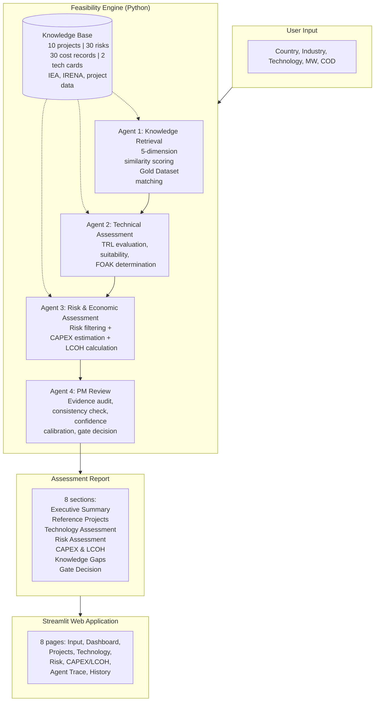

# Green Hydrogen Project Feasibility Copilot

**A structured pre-feasibility assessment engine for industrial green hydrogen projects — PEM and Alkaline electrolysis.**

[](https://github.com/YOUR_USERNAME/hydrogen-copilot)
[](https://python.org)
[](https://streamlit.io)
[](tests/)
[](LICENSE)
[]()

> Built by a Chemical Engineering PhD specialised in Green Hydrogen and Industrial Decarbonisation, with senior expertise in project management, industrial cost engineering, and AI system architecture.

---

### What It Does

| Capability | Description |
|-----------|-------------|
| **Reference Project Matching** | Find comparable hydrogen projects across 10 European references using multi-dimensional similarity scoring |
| **Technology Readiness Assessment** | Evaluate TRL, application suitability, and first-of-a-kind risk for PEM and Alkaline electrolysis |
| **Risk Identification** | Filter 30 validated risk records by technology, scale, and phase with FMEA scoring and mitigation evidence |
| **CAPEX Estimation** | Generate AACE Class 4 cost estimates with taxonomy breakdown, power-law scaling, and learning curves |
| **LCOH Calculation** | Compute levelized cost of hydrogen with full decomposition and tornado sensitivity analysis |
| **Decision Traceability** | Trace every conclusion back to its evidence source through the complete reasoning chain |

### Maturity Indicators

| Dimension | Status |
|-----------|--------|
| Technology Readiness | TRL 8-9 (PEM commercial, Alkaline mature) |
| Knowledge Base | 72 validated records across 4 asset classes |
| Regression Testing | 35/35 passing across 5 demonstration scenarios |
| Quality Framework | Published Source Governance Framework (A/B/C/D) |
| Methodologies | AACE 18R-97, ISO 31000, IEC 60812 (FMEA), PMBOK Phase-Gate |

---

## Table of Contents

- [Why This Project Matters](#why-this-project-matters)
- [Architecture](#architecture)
- [Screenshots](#screenshots)
- [Key Features](#key-features)
- [What Makes This Different](#what-makes-this-different)
- [Validation Results](#validation-results)
- [Knowledge Base](#knowledge-base)
- [Limitations](#limitations)
- [Quick Start](#quick-start)
- [Usage Example](#usage-example)
- [Technology Stack](#technology-stack)
- [Project Structure](#project-structure)
- [Roadmap](#roadmap)
- [License & Disclaimer](#license--disclaimer)

---

## Why This Project Matters

### For Engineering Managers

Pre-feasibility assessments for hydrogen projects are a known bottleneck. Each assessment requires weeks of manual research: locating reference projects, extracting technology specifications from OEM documentation, compiling risk registers from incident databases, and normalising cost data from IEA and IRENA reports across multiple editions. This work is repetitive, error-prone, and produces results that are difficult to compare across projects.

This Copilot replaces that process with a structured, deterministic, fully traceable engine that answers the question: *"What do we currently know about the feasibility of this project?"*

### For PMO and Consulting Teams

| Challenge | This Solution |
|-----------|--------------|
| Searching for comparable reference projects | 5-dimension similarity matching against 10 European projects |
| Normalising technology readiness data | Structured Technology Knowledge Cards with TRL, suitability, and scale assessment |
| Building risk registers from scratch | 30 validated risk records with FMEA scoring and project evidence |
| Estimating CAPEX with defensible ranges | AACE Class 4 methodology with taxonomy breakdown and confidence weighting |
| Producing traceable feasibility reports | 8-section structured output with full source attribution |
| Explaining why conclusions were reached | Agent Trace page showing the complete reasoning chain |

### For Hydrogen Project Developers

- **Technology selection:** Compare PEM vs Alkaline suitability for your specific offtake, scale, and location
- **Risk awareness:** Identify the top risks for your project profile before engaging lenders or EPC contractors
- **Cost benchmarking:** Understand whether your projected CAPEX is within industry norms for your technology and scale
- **Gap identification:** Know what critical information is missing before proceeding to full feasibility study

---

## Architecture

The system implements a **4-agent reasoning pipeline** on top of a validated knowledge base. Every agent uses documented, deterministic methodologies — no machine learning, no black boxes.



### Key Design Decisions

- **Deterministic, not ML-based.** Every calculation uses documented formulas — no black boxes, no training data, no non-deterministic outputs.
- **Zero external dependencies for the engine.** The `src/` package uses only Python standard library. No ML frameworks, no cloud APIs, no databases.
- **File-based knowledge base.** All 72 records are JSON files readable without tooling. Adding a new project requires writing one JSON file.
- **Full source traceability.** The Agent Trace page links every decision to its evidence source, methodology document, and confidence assessment.

---

## Screenshots

| Page | Preview | Description |
|------|---------|-------------|
| **Executive Dashboard** |  | Gate decision banner with dimension quality scores, KPI metrics, and key findings. The primary interface for project review. |
| **Agent Trace (Flagship)** |  | Complete reasoning chain from user input through all 4 agents to the final gate decision. Each step expandable with evidence sources, methodology references, and confidence scores. |
| **CAPEX & LCOH** |  | Cost breakdown by category with bar chart, LCOH waterfall decomposition, and sensitivity tornado diagram identifying dominant cost drivers. |

> **Note:** Screenshots are being prepared. To generate them yourself, see the [screenshot capture guide](docs/screenshots/screenshot_capture_guide.md).

---

## Key Features

### Project Similarity Matching

A 5-dimension weighted scoring engine that evaluates every reference project against the query:

| Dimension | Weight | Scoring Method |
|-----------|--------|----------------|
| Technology match | 30% | Exact (PEM, Alkaline) or hybrid (PEM+Alkaline) |
| Industry / Offtake match | 25% | Exact, secondary, or related offtake category |
| Capacity similarity | 25% | Logarithmic function — symmetric, bounded [0, 1] |
| Country proximity | 15% | Same country, neighbour, sub-region, or continent |
| Project maturity | 5% | Operational > Under construction > Planned |

### Technology Readiness Assessment

Structured assessment drawn from Technology Knowledge Cards (TC-PEM-001, TC-ALK-001):

- **TRL evaluation** with justification based on global deployment evidence and IEA/IRENA references
- **Application suitability scoring** per industrial offtake type (steel, refinery, ammonia, mobility, etc.)
- **FOAK determination** — separately assesses first-of-a-kind risk for scale and for application
- **Scale feasibility check** against proven deployment range from the Gold Dataset

### Risk Identification

Filters 30 validated risk records from the Risk Library by technology, project scale, and project phase:

- **FMEA-based scoring:** Probability (1-5) x Impact (1-5) x Detectability (1-5) = RPN (1-125)
- **8 risk categories:** Technical, Supply Chain, Grid and Energy, Regulatory, Financial, Construction, Operational, Environmental
- **Evidence-linked:** Each risk references Gold Dataset projects where the risk materialised
- **Mitigation-ready:** Each risk carries documented preventive and corrective actions with monitoring indicators

### CAPEX Estimation

Bottom-up estimation using a taxonomy-based percentage breakdown:

- **8 cost categories** with category-specific power-law scaling exponents (0.45 for grid connection to 0.90 for electrolyser stacks)
- **Learning curve projections:** PEM 15% per doubling, Alkaline 10% per doubling
- **FOAK premium:** +5% for application novelty, +10% for scale novelty
- **AACE Class 4** feasibility estimate with P10-P90 confidence range
- **Weighted confidence scoring** per cost component (A/B/C/D)

### LCOH Calculation

Levelized Cost of Hydrogen with full decomposition and sensitivity analysis:

- **Waterfall decomposition:** CAPEX contribution, electricity, stack replacement, maintenance, labour, other OPEX
- **Tornado sensitivity analysis:** Identifies the dominant cost drivers ranked by impact on LCOH
- **Breakeven analysis:** Determines the electricity price at which LCOH reaches competitive thresholds
- **Assumption transparency:** Every input parameter documented with source and confidence

### Full Decision Traceability (Flagship Feature)

The Agent Trace page visualises the complete reasoning chain from query to gate decision:

- 6-step flow: User Input, Agent 1 (Retrieval), Agent 2 (Technical), Agent 3 (Risk and Economic), Agent 4 (PM Review), Final Decision
- Each step displays: the agent's decision, the evidence sources used, the methodology applied, and the confidence assessment
- Every number in the report can be traced back to a specific knowledge record and source document

### PM Gate Review

PMBOK-inspired phase-gate assessment that quality-checks all upstream agent outputs:

- 4-dimension quality scoring: Reference Projects, Technology, Risk, Economics
- Cross-dimension consistency checking between technology verdict, risk profile, and cost estimate
- Confidence calibration against evidence quality
- Structured conditions for advancement to the next project phase

---

## What Makes This Different

### Deterministic Reasoning

The engine uses no machine learning, no neural networks, and no statistical models. Every calculation — project similarity, risk scoring, CAPEX scaling, LCOH decomposition — is a documented formula with an explicable output. Same query produces the same result every time. This is essential for project governance: decisions must be reproducible and auditable.

### Full Traceability

The Agent Trace page is not an afterthought — it is the core differentiator. Every number in the assessment report links to its evidence source. The CAPEX estimate cites a Cost Library record, which cites an IEA benchmark, which has a published methodology and a source quality level. This enables genuine auditability: a reviewer can verify any conclusion independently.

### Industrial-Grade Methodologies

The system does not invent its own scoring. It applies established industrial standards:

| Standard | Application |
|----------|-------------|
| AACE International 18R-97 | Cost estimate classification (Class 5 through Class 1) |
| ISO 31000:2018 | Risk management framework and principles |
| IEC 60812 | Failure Mode and Effects Analysis (FMEA) for risk scoring |
| PMBOK 7th Edition | Phase-gate project governance and stage review |

### No Black-Box AI

The system is transparent by design. There are no hidden weights, no training data dependencies, and no model degradation over time. Every parameter in the similarity scoring, risk assessment, and cost estimation can be inspected, challenged, and adjusted by a domain expert.

---

## Validation Results

The engine has been validated against **5 pre-feasibility scenarios** with rigorous regression testing.

### Test Matrix

| Case | Query | Top Match | Score | TRL | CAPEX Range | LCOH | Gate Decision | Status |
|------|-------|-----------|-------|-----|-------------|------|--------------|--------|
| 1 | France, Steel, PEM, 100 MW, 2029 | Normand'Hy | 0.81 | 8 | EUR 110-210M | EUR 4.96/kg | PROCEED WITH CAUTION | Passed |
| 2 | Germany, Industrial, Alkaline, 300 MW, 2030 | Holland Hydrogen I | 0.93 | 9 | EUR 250-550M | EUR 4.17/kg | PROCEED | Passed |
| 3 | Spain, Refinery, PEM, 20 MW, 2028 | Masshylia | 0.93 | 8 | EUR 25-55M | EUR 5.59/kg | PROCEED | Passed |
| 4 | Belgium, Chemicals, Alkaline, 25 MW, 2029 | Hyoffwind | 0.75 | 9 | EUR 25-70M | EUR 4.89/kg | PROCEED WITH CAUTION | Passed |
| 5 | Portugal, Industrial, PEM, 100 MW, 2030 | Galp Sines | 1.00 | 8 | EUR 100-220M | EUR 4.96/kg | PROCEED | Passed |

### What Was Verified

- **Matching accuracy:** Top-ranked project is always the most relevant by domain-expert judgment
- **Technology consistency:** TRL and application suitability match Technology Card specifications
- **Risk completeness:** All 8 risk categories populated; risk counts within expected range
- **CAPEX plausibility:** Estimates within AACE Class 4 accuracy expectations (P10-P90 ranges)
- **LCOH plausibility:** Decomposition shows electricity as the dominant driver (consistent with hydrogen economics literature)
- **Gate decision logic:** PROCEED for within-evidence cases; PROCEED WITH CAUTION for cases with knowledge gaps

---

## Knowledge Base

| Asset | Records | Source Quality | Content |
|-------|---------|---------------|---------|
| **Gold Dataset** | 10 project references | 50% Level A, 50% Level B | Normand'Hy, HH1, REFHYNE II, HGHH, HyDeal, Puertollano, HySynergy, Hyoffwind, Galp Sines, Masshylia |
| **Risk Library** | 30 risk records | 90% Level A+B | 8 categories, FMEA-scored, mitigation actions, project evidence |
| **Cost Library** | 30 CAPEX records | 73% Class C, 27% derived | 5 categories, installed cost and all-in basis, 2025 EUR |
| **Technology Cards** | 2 knowledge cards | Level B (IEA/IRENA validated) | PEM (TC-PEM-001), Alkaline (TC-ALK-001) |

### Source Quality Framework

Every data point is classified using a published 4-level system:

| Level | Definition | Example Sources |
|-------|-----------|----------------|
| **A** | Official primary source | Developer press releases, OEM datasheets, government filings |
| **B** | Authoritative industry source | IEA Global Hydrogen Review, IRENA cost reports, Technology Cards |
| **C** | Professional media | Industry news, trade journals (supplementary only) |
| **D** | Unverified | Not used in the knowledge base |

---

## Limitations

This section identifies the current boundaries of the system. These are actively being addressed in the product roadmap.

| Limitation | Impact | Status |
|------------|--------|--------|
| **Knowledge base scope:** 10 European projects only | Cannot provide references for MENA, Asia-Pacific, or North America projects | Expansion planned for V2.0 |
| **LCOH confidence:** Uses Class D proxy data for OPEX | LCOH estimates are preliminary until OPEX Library is populated | OPEX Library architecture complete (M9A); population in progress |
| **Single-user, local application** | No multi-user access, no sharing, no cloud deployment | Streamlit Cloud deployment planned for V1.5 |
| **No regulatory database** | Country-specific permitting timelines, RFNBO requirements, and subsidy programs not yet captured | Regulatory module designed (M9 gap analysis); implementation in V3.0 |
| **European cost context only** | Cost benchmarks reflect Western European supply chains and labour rates | Regional multiplier framework exists; data collection for MENA and Asia-Pacific in progress |

These limitations are documented honestly to ensure appropriate use of the system. The architecture is designed to scale — adding projects, risks, and cost records does not require code changes.

---

## Quick Start

### Prerequisites

- Python 3.10 or later
- Git

### Installation

```bash
# Clone the repository
git clone https://github.com/YOUR_USERNAME/hydrogen-copilot.git
cd hydrogen-copilot

# Install web application dependencies (2 packages)
pip install -r streamlit_app/requirements.txt
```

### Run the Command-Line Engine

```bash
python -m src.main
```

This runs the validated test case (France, 100 MW PEM, Steel, 2029) and prints a structured assessment report.

### Run the Web Application

```bash
streamlit run streamlit_app/app.py
```

Open [http://localhost:8501](http://localhost:8501) in your browser.

### Run Regression Tests

```bash
python tests/test_regression.py
```

Expected output: `35/35 passed (0 failures)` — all 5 validation cases produce correct results.

---

## Usage Example

### Query

| Parameter | Value |
|-----------|-------|
| Country | France |
| Industry | Steel |
| Technology | PEM |
| Capacity | 100 MW |
| Target COD | 2029 |

### Output Summary

```
Gate Decision:      PROCEED WITH CAUTION (Confidence: GOOD, 0.65)

Technology:         TRL 8/9 (early commercial)
Suitability:        HIGH for steel (H2-DRI)
Scale Status:       Within proven range (max: 200 MW)

Top Reference:      Normand'Hy (FR, 200 MW PEM) — Score 0.81
Second Reference:   REFHYNE II (DE, 100 MW PEM) — Score 0.81

CAPEX (Central):    EUR 150M (EUR 1,500/kW)
CAPEX Range:        EUR 110M — EUR 210M (AACE Class 4)

LCOH (Central):     EUR 4.96/kg H2
LCOH Range:         EUR 3.70 — EUR 6.74/kg

Top Risks:
  Electrolyzer Manufacturing Capacity (RPN 36 — Supply Chain)
  Grid Connection Delay (RPN 32 — Grid & Energy)

Critical Gap:       No steel-offtake PEM project in Gold Dataset
```

The **Agent Trace page** allows you to trace every number back to its source: "CAPEX EUR 150M — sourced from Cost Library record CS-IND-006, scaled from IEA GHR 2025 benchmark, adjusted for PEM learning rate."

---

## Technology Stack

| Layer | Technology | Rationale |
|-------|-----------|----------|
| **Reasoning Engine** | Python 3.10+ (stdlib only) | Zero external dependencies; deterministic, auditable execution |
| **Web Application** | Streamlit | Data-native UI framework; rapid prototyping with session state |
| **Knowledge Base** | JSON (72 records, 310 KB) | Human-readable, version-controllable, no database infrastructure |
| **Cost Methodology** | AACE International 18R-97 | Industry-standard cost estimate classification |
| **Risk Methodology** | ISO 31000 / IEC 60812 (FMEA) | International standards for risk management and failure mode analysis |
| **Gate Review** | PMBOK Phase-Gate (PMI) | Project Management Institute standard for stage-gate governance |
| **Source Governance** | Custom A/B/C/D framework | Published quality taxonomy for data source classification |

---

## Project Structure

```
hydrogen-copilot/
│
├── src/                              # Reasoning engine (stdlib only, 14 files)
│   ├── engines/                      #   6 reasoning engines (matching, tech,
│   │                                 #   risk, cost, LCOH, PM review)
│   ├── loaders/                      #   JSON knowledge base loaders
│   ├── models/                       #   Domain data models (dataclasses)
│   ├── utils/                        #   Country/industry normalisation, scoring
│   ├── config/                       #   Path configuration
│   └── main.py                       #   CLI entry point, FeasibilityEngine class
│
├── streamlit_app/                    # Web application (10 files)
│   ├── app.py                        #   Entry point, sidebar, CSS theme
│   ├── pages/                        #   8 multi-page application views
│   │   ├── 01_Project_Input.py       #     Input form
│   │   ├── 02_Assessment_Report.py   #     Executive dashboard
│   │   ├── 03_Reference_Projects.py  #     Matched projects with scores
│   │   ├── 04_Technology_Assessment.py #   Technology details and TRL
│   │   ├── 05_Risk_Assessment.py     #     Risk heatmap and details
│   │   ├── 06_CAPEX_LCOH.py          #     Cost breakdown and LCOH
│   │   ├── 07_Agent_Trace.py         #     Decision traceability (flagship)
│   │   └── 08_Assessment_History.py  #     Session history
│   ├── components/                   #   PDF report export
│   ├── utils/                        #   Session management, CSS theme
│   └── requirements.txt             #   2 dependencies (streamlit, pandas)
│
├── knowledge_base/                   # 141 files (72 structured records)
│   ├── project_references/           #   10 Gold Dataset project records
│   ├── risk_library/                 #   30 risk records (8 categories)
│   ├── cost_library/                 #   30 CAPEX records (5 categories)
│   ├── technology_cards/             #   2 knowledge cards (PEM, Alkaline)
│   ├── templates/                    #   JSON schema templates for data entry
│   ├── reports/                      #   Validation and coverage reports
│   └── ...                           #   Architecture documents (69 files)
│
├── tests/                            # Regression test suite
│   └── test_regression.py            #   35 assertions across 5 test cases
│
├── docs/                             # Documentation
│   └── screenshots/                  #   Application screenshots
│
├── .streamlit/config.toml            # Streamlit theme and server config
├── README.md
├── README_v2.md
├── deployment_guide.md
└── LICENSE
```

---

## Roadmap

| Version | Scope | Status | Timeline |
|---------|-------|--------|----------|
| **V1.0** | **Streamlit MVP** — local application, 4-agent pipeline, 72 knowledge records, 8-page UI, 35/35 regression tests | **Current** | Shipped |
| **V1.5** | **Cloud Deployment** — Streamlit Cloud, public URL, CI/CD pipeline | Next | 2-4 weeks |
| **V2.0** | **Production Knowledge Base** — 30+ projects, 50+ risks, 50+ cost records, OPEX Library, Class C LCOH | Planned | Q3 2026 |
| **V3.0** | **Multi-Agent Runtime** — 6-agent architecture, agent communication protocol, contradiction detection, regulatory module | Planned | Q4 2026 |
| **V4.0** | **Enterprise Platform** — User authentication, multi-project portfolio, REST API, knowledge base as a service | Future | 2027 |

### Delivered

- Core engine with 4-agent reasoning pipeline
- 8-page Streamlit web application with professional green-energy theme
- Agent Trace page for complete decision transparency
- PDF report export
- 72 validated knowledge records with published source governance
- 35/35 regression tests passing

### In Progress

- Streamlit Cloud deployment
- OPEX Library population (electricity, maintenance, stack replacement, labour)
- Knowledge base expansion to 20+ projects

---

## License & Disclaimer

### License

This project is licensed under the MIT License — see the [LICENSE](LICENSE) file for details.

### Disclaimer

**This is a pre-feasibility assessment tool.** It does not replace detailed FEED engineering, investment decision-making, or professional engineering judgment. All CAPEX estimates are AACE Class 4 (feasibility, +/- 20-30%). LCOH estimates are Class D (preliminary) until the OPEX Library is populated. The knowledge base reflects publicly available information as of June 2026 and may not reflect current market conditions.
